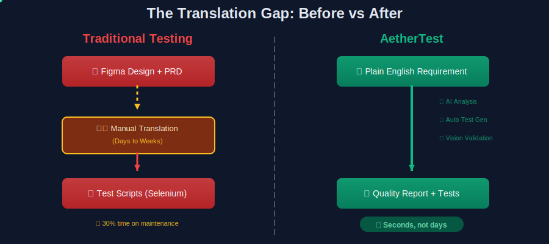
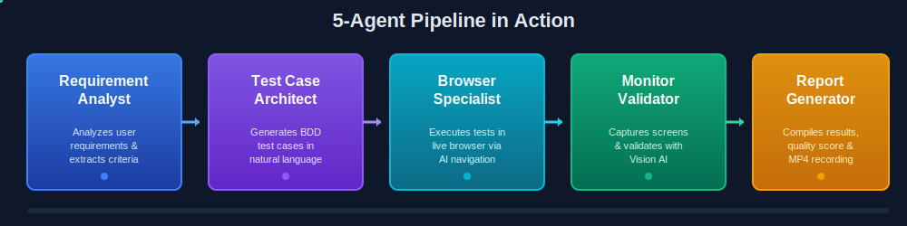

# AetherTest — The Autonomous STLC Engine

<p align="center">
  
</p>

> **"From Low-Code to Zero-Touch AI Driven Test Automation"**
>
> Describe what to test in plain English. Watch AI agents analyze requirements, generate test cases,
> execute them in a live browser, validate results with computer vision, and deliver a quality report —
> entirely autonomously. No scripts. No selectors. No manual translation.

<p align="center">
  
  
  
  
  
  
</p>

---

## 🏆 AWS Hackathon Submission

**Team:** [Your Team Name]  
**Category:** AI/ML Innovation with Amazon Bedrock  
**AWS Services Used:**
- Amazon Bedrock (Nova Pro, Claude Haiku 4.5)
- Strands Agents SDK (Optional orchestration mode)
- AWS Bedrock AgentCore Runtime (Deployment target)
- AWS Bedrock AgentCore Memory (Session persistence)

---

## Why "AetherTest"?

In ancient Greek philosophy, **Aether** (αἰθήρ) was the fifth element — the pure, invisible substance believed to fill the heavens. We chose this name because it mirrors what AetherTest does:

| Aether (the element)            | AetherTest (the platform)                                             |
| ------------------------------- | --------------------------------------------------------------------- |
| Invisible, yet omnipresent      | AI agents work silently — no scripts to see, no selectors to maintain |
| Fills the space between things  | Bridges the gap between requirements and verified test results        |
| Moves without friction          | Zero-touch — no manual translation, no human bottleneck               |

---

## The Problem — The Translation Gap

<p align="center">
  
</p>

**Current tools don't solve this.** Selenium, Cypress, even "low-code" tools still require:
- Manual authoring of test scripts
- DOM selector maintenance (breaks on every UI change)
- Testing can only start after code is "stable"

**AetherTest eliminates this translation gap entirely.**

---

## The Innovation — Zero-Touch AI Testing

<p align="center">
  
</p>

| Dimension            | Selenium / Cypress    | **AetherTest**                              |
| -------------------- | --------------------- | ------------------------------------------- |
| Test Creation        | Manual scripting      | Plain English description (seconds)         |
| Element Targeting    | DOM selectors         | Vision-based — identifies by appearance     |
| UI Change Resilience | Breaks, manual fix    | Self-heals via LLM reasoning                |
| Maintenance          | 30% of tester time    | Near-zero — AI adapts automatically         |

---

## Architecture

```
┌─────────────────────────────────────────────────────────────────────────────────┐
│                              AMAZON BEDROCK                                      │
│  ┌─────────────────────┐  ┌─────────────────────┐  ┌─────────────────────────┐  │
│  │   Amazon Nova Pro   │  │  Claude Haiku 4.5   │  │   Claude Haiku 4.5      │  │
│  │   (Orchestrator)    │  │  (Vision Analysis)  │  │   (Browser Automation)  │  │
│  └─────────────────────┘  └─────────────────────┘  └─────────────────────────┘  │
└─────────────────────────────────────────────────────────────────────────────────┘
                                       │
                    ┌──────────────────┼──────────────────┐
                    │                  │                  │
                    ▼                  ▼                  ▼
┌───────────────────────┐  ┌───────────────────┐  ┌───────────────────────────┐
│   FastAPI Backend     │  │   Next.js 14      │  │   Browser Sandbox         │
│   • Orchestrator      │  │   • Dashboard     │  │   • Chromium + CDP        │
│   • WebSocket         │  │   • Live VNC      │  │   • noVNC streaming       │
│   • Tool Dispatcher   │  │   • Test Results  │  │   • FFmpeg recording      │
│   Port: 8001          │  │   Port: 3001      │  │   Ports: 9222, 6080, 8888 │
└───────────────────────┘  └───────────────────┘  └───────────────────────────┘
```

### 5-Agent Pipeline

<p align="center">
  
</p>

| Phase | Agent | Tools | Output |
|-------|-------|-------|--------|
| 1 | Requirement Analyst | — | Structured breakdown |
| 2 | Test Case Architect | `register_test_cases` | BDD test cases |
| 3 | Browser Specialist | `execute_browser_task`, `get_credentials` | Live browser actions |
| 4 | Monitor Validator | `capture_screenshot`, `analyze_screenshot` | PASS/FAIL verdicts |
| 5 | Report Generator | `save_report` | Quality report |

---

## Browser Automation — Chrome DevTools Protocol (CDP)

AetherTest uses **browser-use** library with **Chrome DevTools Protocol (CDP)** for browser automation:

```python
# Connect to sandbox Chromium via CDP
browser = Browser(cdp_url="http://localhost:9222", keep_alive=True)

# AI-driven browser agent with Claude Haiku 4.5
agent = BrowserAgent(
    task="Click the login button and enter credentials",
    llm=ChatAWSBedrock(model="claude-haiku-4.5"),
    browser=browser,
    use_vision=True  # Vision-based element identification
)
```

**Why CDP over Playwright/Selenium?**
- **Vision-first**: AI identifies elements by appearance, not brittle selectors
- **Self-healing**: Adapts to UI changes without breaking
- **Live visibility**: Actions visible in real-time via noVNC
- **AI-native**: Built for LLM-driven automation

---

## Quick Start

### Prerequisites
- Docker Desktop
- AWS Account with Bedrock access (Nova Pro + Claude Haiku 4.5)

### 1. Configure Environment
```bash
cp .env.example .env
# Edit .env with your AWS credentials:
# AWS_ACCESS_KEY_ID=AKIA...
# AWS_SECRET_ACCESS_KEY=...
# AWS_REGION=us-east-1
```

### 2. Launch with Docker
```bash
docker compose up --build
```

### 3. Access the Application
- **Dashboard**: http://localhost:3001
- **Live Browser**: http://localhost:6080
- **API Docs**: http://localhost:8001/docs

### 4. Run a Test
1. Enter a requirement: *"Test login with valid and invalid credentials"*
2. Enter target URL: *"https://the-internet.herokuapp.com/login"*
3. Select test scope (Quick/Standard/Thorough)
4. Click **Launch** and watch the AI work!

---

## AWS Services Integration

### Amazon Bedrock Models

| Model | Purpose | API |
|-------|---------|-----|
| **Amazon Nova Pro** | Orchestrator — planning, reasoning, tool orchestration | Converse API |
| **Claude Haiku 4.5** | Vision analysis — screenshot validation | invoke_model |
| **Claude Haiku 4.5** | Browser automation — AI-driven navigation | ChatAWSBedrock |

### Strands Agents SDK (Optional)

AetherTest supports the [Strands Agents SDK](https://strandsagents.com/) for simplified orchestration:

```bash
# Enable Strands mode
USE_STRANDS=true
```

Benefits:
- Simplified agent loop management
- Built-in streaming and callback support
- Ready for AWS Bedrock AgentCore deployment

---

## AWS Deployment Architecture (Target State)

```
┌─────────────────────────────────────────────────────────────────────────────────┐
│                              AWS CLOUD                                           │
│  ┌─────────────────────┐  ┌─────────────────────┐  ┌─────────────────────────┐  │
│  │   API Gateway       │  │  Cognito            │  │   CloudFront            │  │
│  │   REST + WebSocket  │  │  Authentication     │  │   CDN                   │  │
│  └─────────────────────┘  └─────────────────────┘  └─────────────────────────┘  │
│                                       │                                          │
│  ┌─────────────────────┐  ┌─────────────────────┐  ┌─────────────────────────┐  │
│  │ AgentCore Runtime   │  │  AgentCore Memory   │  │   ECS Fargate           │  │
│  │ Strands Agent       │  │  Short/Long-term    │  │   Browser Sandbox       │  │
│  └─────────────────────┘  └─────────────────────┘  └─────────────────────────┘  │
│                                       │                                          │
│  ┌─────────────────────┐  ┌─────────────────────┐  ┌─────────────────────────┐  │
│  │   DynamoDB          │  │  S3                 │  │   CloudWatch + X-Ray    │  │
│  │   Sessions/Tests    │  │  Reports/Recordings │  │   Observability         │  │
│  └─────────────────────┘  └─────────────────────┘  └─────────────────────────┘  │
└─────────────────────────────────────────────────────────────────────────────────┘
```

See [COMPREHENSIVE_AWS_DEPLOYMENT_PLAN.md](./COMPREHENSIVE_AWS_DEPLOYMENT_PLAN.md) for full deployment guide.

---

## Tech Stack

### Backend
| Component | Technology |
|-----------|------------|
| API Framework | FastAPI |
| AI Platform | AWS Bedrock |
| Orchestrator | Amazon Nova Pro |
| Vision/Browser | Claude Haiku 4.5 |
| Browser Automation | browser-use + CDP |
| Database | SQLite |

### Frontend
| Component | Technology |
|-----------|------------|
| Framework | Next.js 14 |
| Styling | Tailwind CSS |
| State | Zustand |
| Animations | Framer Motion |
| Live Browser | noVNC iframe |

### Infrastructure
| Component | Technology |
|-----------|------------|
| Containers | Docker Compose |
| Browser | Chromium + CDP |
| VNC | x11vnc + noVNC |
| Recording | FFmpeg |

---

## Project Structure

```
AetherTest/
├── docker-compose.yml          # 3 services: frontend, backend, sandbox
├── .env.example                # Environment template
│
├── backend/
│   ├── app/
│   │   ├── agents/
│   │   │   ├── orchestrator.py         # Bedrock Converse loop
│   │   │   └── strands_orchestrator.py # Strands SDK mode
│   │   ├── memory/                     # Always-On Memory Layer
│   │   │   ├── models.py               # Memory dataclasses
│   │   │   ├── service.py              # Unified MemoryService
│   │   │   ├── local_store.py          # SQLite store (dev)
│   │   │   └── agentcore_store.py      # AWS AgentCore (prod)
│   │   ├── tools/
│   │   │   ├── browser_tools.py        # CDP + browser-use
│   │   │   ├── vision_tools.py         # Claude Haiku vision
│   │   │   └── storage_tools.py        # Reports + credentials
│   │   └── api/
│   │       ├── sessions.py             # Session management
│   │       ├── credentials.py          # Encrypted credentials
│   │       ├── recording.py            # Screen recording
│   │       └── memory.py               # Memory Layer API
│   └── requirements.txt
│
├── frontend/
│   ├── app/                    # Next.js pages
│   ├── components/             # React components
│   │   ├── 3d/                 # Animated visualizations
│   │   └── ui/                 # Glass morphism UI
│   └── hooks/                  # WebSocket + state
│
└── sandbox/
    ├── Dockerfile              # Chromium + noVNC
    ├── start.sh                # Service startup
    └── recorder.py             # FFmpeg API
```

---

## Memory Layer (Always-On)

AetherTest includes an always-on memory layer for learning from past test sessions:

### Features
- **Memory Storage**: Store structured memories with entities, topics, importance
- **Semantic Search**: Search memories by text content
- **Consolidation**: Automatically find patterns across memories
- **Flexible Backend**: SQLite (dev) or AWS AgentCore Memory (prod)

### Configuration
```bash
# Local development
MEMORY_STORE_TYPE=local
MEMORY_DB_PATH=./data/memory.db

# Production (AWS AgentCore)
MEMORY_STORE_TYPE=agentcore
AGENTCORE_MEMORY_ID=your-memory-id
AGENTCORE_MEMORY_REGION=us-west-2
```

### API Endpoints
| Method | Endpoint | Description |
|--------|----------|-------------|
| `GET` | `/api/memory/status` | Memory statistics |
| `GET` | `/api/memory/memories` | List all memories |
| `POST` | `/api/memory/ingest` | Ingest text |
| `GET` | `/api/memory/search?q=` | Search memories |
| `POST` | `/api/memory/query` | Query memories |
| `POST` | `/api/memory/consolidate` | Consolidate memories |

---

## Demo

**90-second demo flow:**
1. Type requirement in plain English
2. Select test scope (3/5/20 test cases)
3. Click Launch — watch 5-agent pipeline activate
4. Live browser panel shows real Chrome executing tests
5. Test cases populate with live PASS/FAIL status
6. Quality report with score, summary, and MP4 recording

---

## Cost Estimate

| Component | Cost per Test |
|-----------|---------------|
| Vision analysis | ~$0.01 |
| Browser task | ~$0.02 |
| **Per test case** | **~$0.03** |
| **100 test cases** | **~$3** |

---

## License

MIT License

---

## Team

**[Your Team Name]**
- [Team Member 1] — [Role]
- [Team Member 2] — [Role]
- [Team Member 3] — [Role]

---

<p align="center">
  <b>Built with ❤️ for the AWS Hackathon using Amazon Bedrock</b>
</p>
